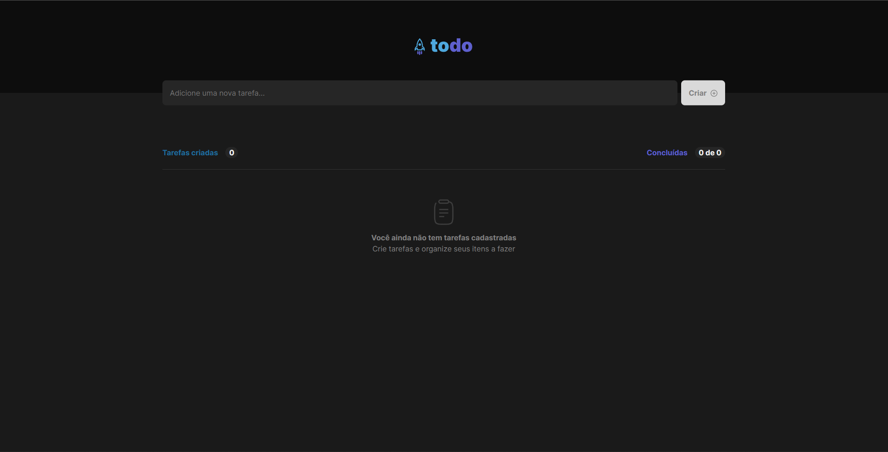
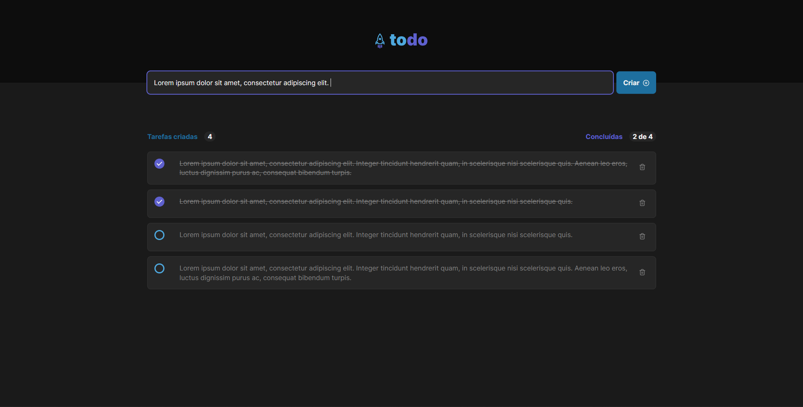
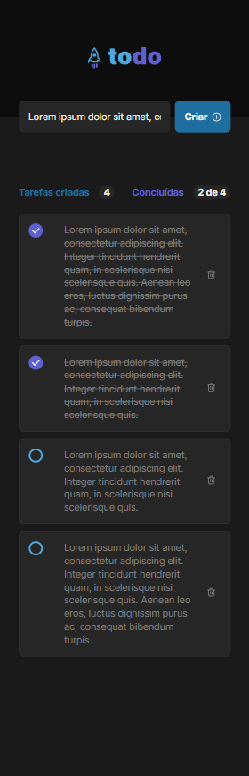

<div align="center">

<br />
<br />
<br />

</div>
<div align="center">

[](https://gabriel-devco.github.io/ignite-todo) &nbsp;  &nbsp;  &nbsp; 

</div>

This project was developed during Ignite course from [Rocketseat](https://rocketseat.com.br/).
Its main goal is to apply and develop the main concepts of React framework.

The application is a simple to-do list, where you can add, complete and delete tasks.
These tasks are stored in browser's local storage, so you can reuse the application with previous registered tasks, even if you close the browser.

There is a **[live demo](https://gabriel-devco.github.io/ignite-todo/)** deployed in Github Pages, where you can test it.

## Preview

| Desktop                            | Desktop                                 | Mobile                              |
| ---------------------------------- | --------------------------------------- | ----------------------------------- |
|  |  |  |

## Installation

You need [node](https://nodejs.org/en/download/) to run this project. This example was created using version `v16.15.1`.

### Installation and usage

To run this application you need to install dependencies:

```sh
npm install
```

Then you can run with:

```sh
npm run dev
```

## Contact

[](https://github.com/gaprados/) [](https://twitter.com/gapraado/)

## License

The [MIT License]() (MIT)

Copyright :copyright: 2022
